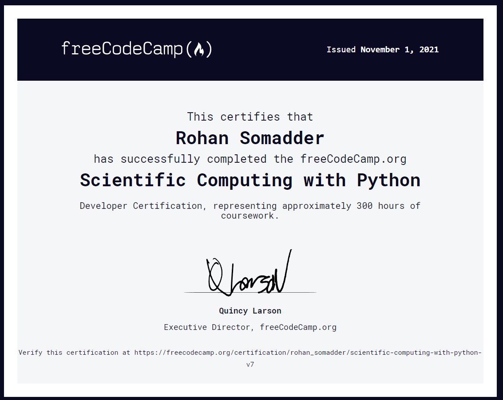

# Contains All Materials for the course including the projects done and certificate.
## [Free Code Camp Account 👨‍🎓](https://www.freecodecamp.org/rohan_somadder) 
# Projects Done - 
* [Arithmetic-formatter](https://github.com/Rohan-Somadder/Scientific-Computing-with-Python-FCC.org/tree/main/Arithmetic-formatter)
* [Time-calculator](https://github.com/Rohan-Somadder/Scientific-Computing-with-Python-FCC.org/tree/main/Time-calculator)
* [Budget-app](https://github.com/Rohan-Somadder/Scientific-Computing-with-Python-FCC.org/tree/main/Budget-app)
* [Polygon-area-calculator](https://github.com/Rohan-Somadder/Scientific-Computing-with-Python-FCC.org/tree/main/Polygon-area-calculator)
* [Probability-calculator](https://github.com/Rohan-Somadder/Scientific-Computing-with-Python-FCC.org/tree/main/Probability-calculator)
# Certificate
